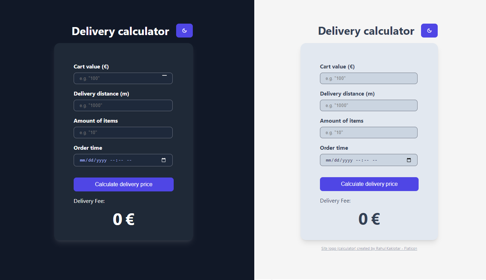

# Delivery calculator



### Table of contents

- [Introduction](#introduction)
- [Built with](#built-with)
- [Project structure](#project-structure)
- [Prerequisites](#prerequisites)
- [How to use](#how-to-use)
- [Acknowledgement](#acknowledgement)
- [Demo](#demo)

## Introduction

### Wolt Summer 2024 Engineering Internships Take-home assignment.

A delivery calculator that adheres to specific conditions laid in [this](https://github.com/woltapp/engineering-internship-2024?tab=readme-ov-file#specification) repository. </br>
The calculator takes several inputs: the value of the cart in Euro, delivery distance, amount of items, as well as time of order. Based on the specification linked above, it will calculate the delivery fee. The app also features a dark/light theme toggle.

For this assingmnet, I decided to go with styled-components as it fits with React's component-based approach. I like how it's reusable and modular, just like a React component. It's also pretty fun to write.

## Built with


## Project structure

. </br>
├── src </br>
│ ├── components - React components </br>
│ ├── interfaces </br>
│ ├── reducers </br>
│ ├── services - contains business logic - in this case, the main calculation </br>
│ │ └── utils - helper functions for main business logics </br>
│ └── ui-components - styled-component files & theme </br>
│ </br>
├── tests - unit/integration tests</br>

## Prerequisites

- npm
- TypeScript
- React
- Styled Components
- Jest for testing

```
# Install TypeScript (Please cd to the directory)
npm install --save typescript @types/node @types/react @types/react-dom @types/jest

# Install Jest
npm install --save-dev jest babel-jest @babel/preset-env @babel/preset-react react-test-renderer @babel/core @babel/preset-typescript @types/jest
//make sure babel.config.json has the following
{
	"presets": [
		["@babel/preset-env", { "targets": { "node": "current" } }],
		"@babel/preset-typescript"
	],
	"plugins": ["@babel/plugin-transform-react-jsx"]
}

# Install Styled Components
npm install styled-components
```

## How to use

### `npm start`

Runs the app in the development mode.\
Open [http://localhost:3000](http://localhost:3000) to view it in the browser.

### `npm test`

Launches Jest and runs all tests in the ./tests directory.

## Acknowledgement

Some elements, like the color palettes, as well as boxshadows, have been taken from [Tailwind's](https://tailwindcss.com/docs/customizing-colors) docs.

## Demo

<a href="https://gyazo.com/90275c06ab22b0838ba445dc448bb527"></a>
<a href="https://gyazo.com/29f3ddb33d47b293831f1e6daa2b7a32"></a>
