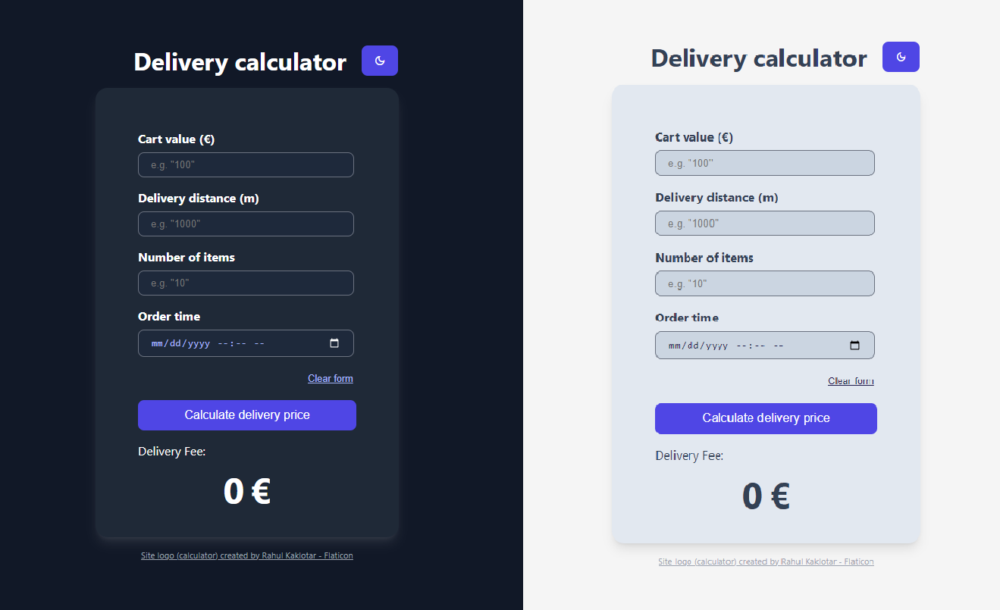

# Delivery calculator

Wolt Summer 2024 Engineering Internships Take-home assignment.  
A delivery calculator that adheres to specific conditions laid in [this](https://github.com/woltapp/engineering-internship-2024?tab=readme-ov-file#specification) repository.

## Built with

## How to use
### `npm start`

Runs the app in the development mode.\
Open [http://localhost:3000](http://localhost:3000) to view it in the browser.

### `npm test`

Launches Jest and runs all tests in the ./tests directory.
